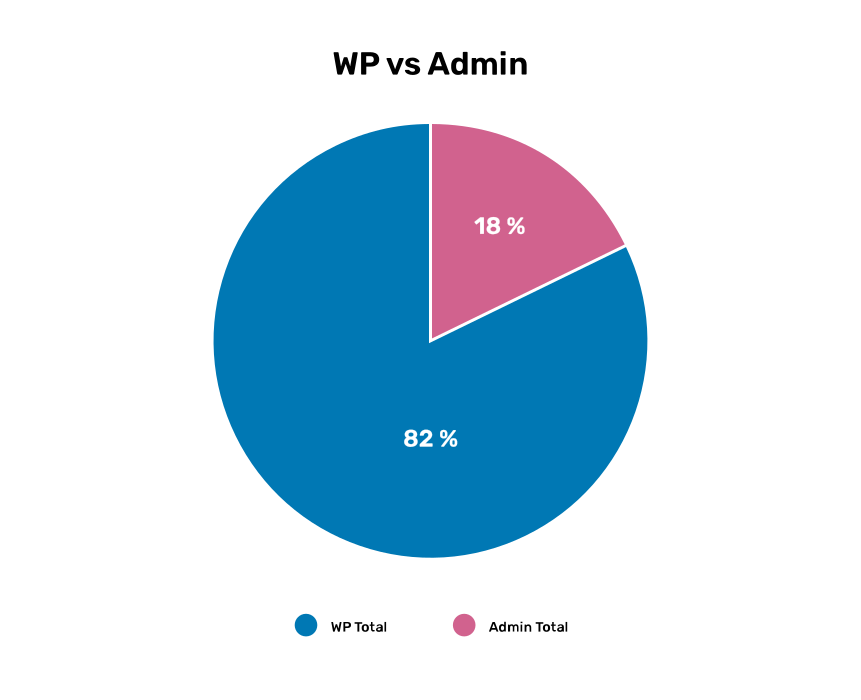
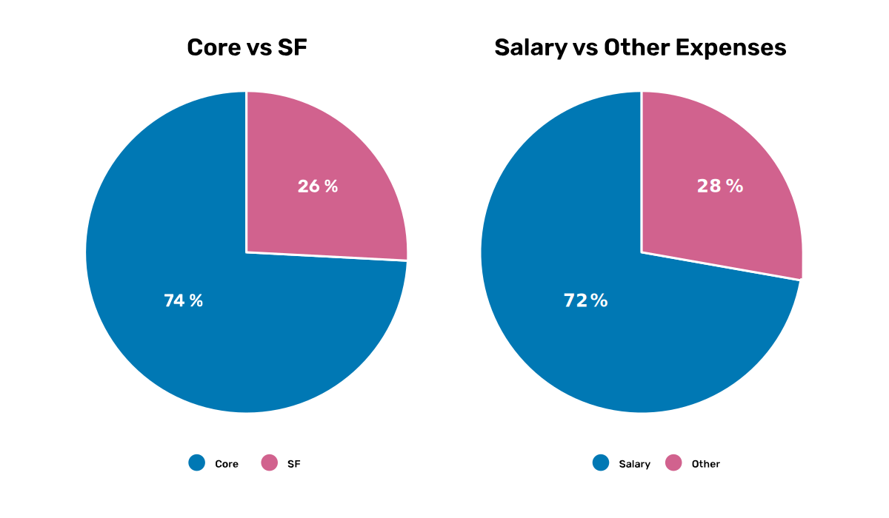
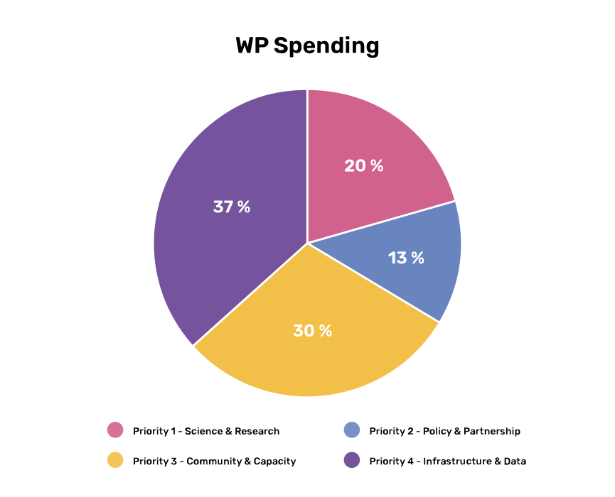

[[indicative-budget]]
== Indicative budget for 2025

The Secretariat is developing a draft budget to present to Governing Board to match this Work Programme. It includes funds for Work Programme activities as well as Secretariat administration and governance, and it delineates funding from basic financial contributions (core) and supplementary funds. The budget planning process is both complex and tentative as we await decisions on external proposals for funding that will support our activities in 2025.

At this point the Secretariat expects to receive €4.7 million in income from basic financial contributions, mainly from Voting Participants, and will bring in €1 million in supplementary funds in 2025.

The expenses in the draft 2025 budget total €5.7 million, with €4.7 million euros going towards Work Programme 2025 (<>) and the remainder for administration and governance. This total includes both core and supplementary fund expenditures. 

.Expected Secretariat expenses for the 2025 Work Programme and Secretariat administration and governance. 
[#img-chart1]

The draft 2025 budget includes expenses for staff salaries, external contractors, and non-salary expenses for meetings and travel. This total reflects expenditures from both core and supplementary funds. Supplementary funds enable 36 per cent more total WP activities. Seventy-two per cent of the 2025 expenses are expected to be staff salaries (<>). 

.Expected breakdown of Work Programme expenses, showing core vs. supplementary funding (_left_) and salary vs. other expenses (_right_). 
[#img-chart2]

All four Priority Area budgets (<>) include costs for staff salary, external contracts, and non-salary expenses, such as meetings and travel. The largest expense in all Priority Areas is staff salary. The expected of WP expenses are highest for Priority Area 3 and Priority Area 4.

.Work Programme 2025 expense breakdown across the four Priority Areas.
[#img-chart3]

